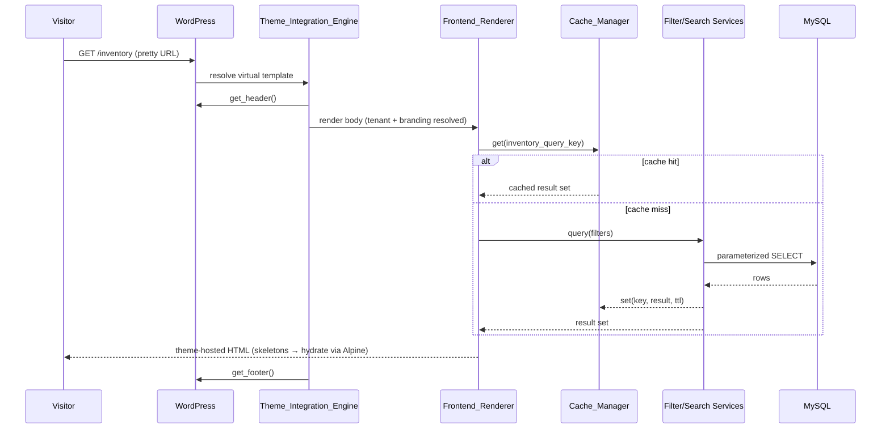
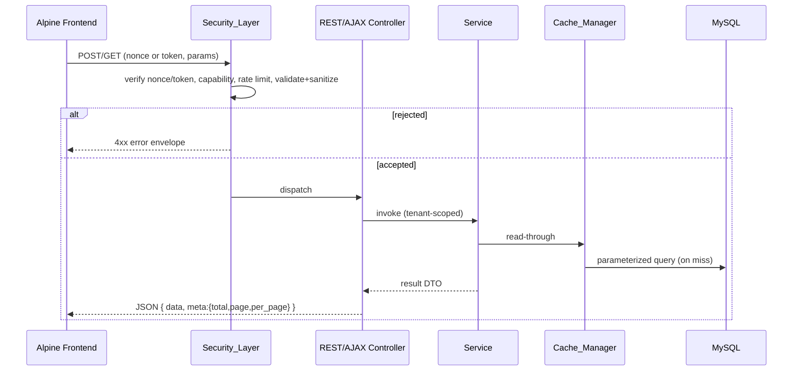
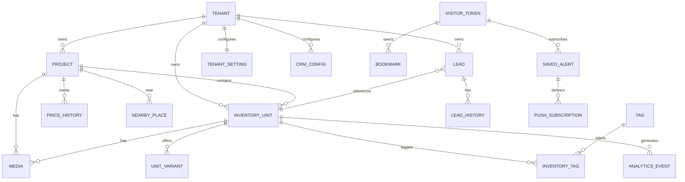

# Design Document — RIMS Pro (Resale Inventory Management System)

## Overview

RIMS Pro is an enterprise-grade real estate resale inventory platform delivered as a **native WordPress plugin**. It targets brokers and builders (first deployment: GoldLine Estate) and is architected from day one for white-label, multi-tenant SaaS resale.

The single most important design constraint is **native theme integration**: every public-facing page the plugin renders must appear between the active theme's `get_header()` and `get_footer()` output, inherit the theme's menus, color system, typography, and responsive breakpoints, and scope all of its own CSS/JS under a reserved `rims-` namespace so it never bleeds into the host theme. On that foundation, RIMS Pro layers a premium 2026 PropTech experience: glassmorphism cards, four view modes (Card, Table, Broker Sheet, Map), advanced + natural-language search, a lead-capture and Kanban lead-management pipeline, an admin analytics dashboard, media management, AI content generation, branded PDF/Excel exports, PWA + push, QR codes, comparison/bookmarks, and CRM integrations.

This design realizes the 33 requirements in `requirements.md`. It uses the glossary names defined there (e.g., `Theme_Integration_Engine`, `Smart_Search_Engine`, `Filter_Engine`, `Inventory_Unit`, `Unit_Status`) as the canonical component and entity names.

### Design Goals

1. **Indistinguishable from the theme** — frontend output is theme-hosted, prefix-scoped, and reflows at the theme's breakpoints (Req 1).
2. **Premium, fast UX** — Tailwind + Alpine.js, glassmorphism, dark/light, skeleton loading, infinite scroll, while meeting Lighthouse ≥ 90, Core Web Vitals, and < 300 ms API responses (Req 24, 25).
3. **Correct, testable business logic** — search parsing, filtering, redaction, comparison limits, expiry, pagination, tenant scoping, and slug generation are pure, deterministic functions that are property-tested.
4. **Secure by construction** — nonces/CSRF, output escaping, parameterized queries, capability checks, rate limiting, HTTPS, input validation (Req 23).
5. **Resale-ready** — per-tenant data scoping and branding so the same codebase serves many brokers (Req 33).

### Technology Stack

| Layer | Technology | Rationale |
|-------|-----------|-----------|
| Runtime | PHP 8.3+ (typed properties, enums, readonly, `match`) | Strong typing for domain models and enums (`Unit_Status`, pipeline stages) |
| Database | MySQL 8+ (InnoDB, JSON columns, CTEs, window functions) | Relational integrity + JSON for flexible attributes; window functions for analytics rankings |
| Platform | WordPress 6.4+ plugin (MVC + service layer) | Theme integration, capabilities, nonces, cron, object cache, shortcodes |
| API | WordPress REST API, versioned namespace `rims/v1` | Standardized JSON surface for AJAX frontend and future mobile apps (Req 31) |
| Frontend CSS | Tailwind CSS (build-time, `rims-` prefixed + scoped) | Utility-first, purged for performance; prefix prevents theme bleed (Req 1.6) |
| Frontend JS | Alpine.js (lightweight reactivity) + vanilla ES modules | Small footprint for CWV; declarative view-mode/filter state |
| Caching | WP Object Cache abstraction, Redis-ready (via drop-in) | Transparent Redis backend when configured (Req 24.6–24.8) |
| Charts | Chart.js | Admin dashboard charts and project price trend (Req 12.5, 17.2) |
| Maps | Google Maps JavaScript API | Map View pins + info overlays (Req 11) |
| PDF | Dompdf (or mPDF) | Server-side branded PDF generation (Req 10.7, 22.1) |
| Excel | PhpSpreadsheet | Multi-sheet XLSX workbooks (Req 10.8, 22.2) |
| Images | WP image subsystem + Intervention Image | Crop, compress, watermark (Req 19) |
| PWA | Web App Manifest + Service Worker (Workbox) | Installability + offline shell (Req 28) |
| Push | Web Push (VAPID) | New-inventory alerts (Req 28.3) |

---

## Architecture

### Architectural Style

RIMS Pro follows a **layered MVC + service architecture** inside a single WordPress plugin. Controllers are thin (REST controllers, AJAX handlers, shortcode renderers, admin screens). All business logic lives in **Services** that operate on **Repositories** (data-access objects wrapping `$wpdb` with parameterized statements). **Views** are PHP templates plus Tailwind/Alpine components. This keeps the testable core (services + value objects) free of WordPress globals so it can be unit- and property-tested.

```mermaid
graph TD
    subgraph Client["Client / Browser"]
        UI["Theme-hosted Frontend<br/>(Tailwind + Alpine.js)"]
        SW["Service Worker / PWA Shell"]
        Mobile["Future Mobile App"]
    end

    subgraph WP["WordPress Runtime (PHP 8.3+)"]
        subgraph Presentation["Presentation Layer"]
            TIE["Theme_Integration_Engine"]
            SC["Shortcode_Registrar"]
            EW["Elementor_Widget_Provider"]
            FR["Frontend_Renderer (Views)"]
            ADM["Admin_Dashboard Screens"]
        end

        subgraph Controllers["Controller Layer"]
            REST["REST_API Controllers<br/>(rims/v1)"]
            AJAX["AJAX Handlers"]
        end

        subgraph Services["Service Layer (testable core)"]
            SEARCH["Smart_Search_Engine"]
            FILTER["Filter_Engine"]
            VIEW["View_Manager"]
            LEAD["Lead_Capture / Lead_Management"]
            INV["Inventory_Manager"]
            MEDIA["Media_Gallery_Manager"]
            ANALYTICS["Analytics_Engine"]
            AI["AI_Content / AI_Tag Generator"]
            EXPORT["Export_Engine"]
            SEO["SEO_Engine"]
            EXPIRY["Expiry_Manager"]
            CRM["CRM_Integration_Service"]
            CMP["Comparison / Bookmark / RecentlyViewed"]
            SEC["Security_Layer"]
            CACHE["Cache_Manager"]
            TENANT["Tenant / Branding Resolver"]
        end

        subgraph Data["Repository Layer"]
            REPO["Repositories ($wpdb, parameterized)"]
        end
    end

    subgraph Infra["Infrastructure"]
        DB[("MySQL 8+")]
        REDIS[("Redis Object Cache (optional)")]
        GMAPS["Google Maps API"]
        AIP["AI Provider"]
        CRMP["CRM Platforms<br/>Sell.Do / LeadSquared / HubSpot / Zoho"]
        PUSH["Web Push Service"]
    end

    UI -->|get_header/get_footer| TIE
    UI -->|AJAX / fetch| AJAX
    UI -->|fetch JSON| REST
    Mobile -->|token auth| REST
    SW --> UI

    SC --> FR
    EW --> FR
    TIE --> FR
    FR --> Services
    ADM --> Services
    REST --> SEC --> Services
    AJAX --> SEC --> Services

    Services --> CACHE
    CACHE --> REDIS
    Services --> REPO --> DB
    VIEW --> FILTER
    SEARCH --> FILTER
    Services --> TENANT
    MEDIA --> AIP
    AI --> AIP
    CRM --> CRMP
    Map_View -.-> GMAPS
    ANALYTICS --> PUSH
```



### Plugin Directory Structure

```
rims-pro/
├── rims-pro.php                  # Bootstrap: activation/deactivation hooks, autoloader
├── composer.json                 # Dompdf, PhpSpreadsheet, Intervention, web-push
├── includes/
│   ├── Core/                     # Plugin, Activator, Deactivator, Container (DI)
│   ├── Domain/                   # Value objects, enums (UnitStatus, PipelineStage), DTOs
│   ├── Services/                 # All *_Engine / *_Manager service classes
│   ├── Repositories/             # InventoryRepository, ProjectRepository, ...
│   ├── Rest/                     # REST controllers under rims/v1
│   ├── Ajax/                     # AJAX handlers
│   ├── Shortcodes/               # Shortcode_Registrar + renderers
│   ├── Elementor/                # Widget_Provider + widget classes
│   ├── Admin/                    # Dashboard, inventory CRUD, lead board screens
│   ├── Frontend/                 # Theme_Integration_Engine, Frontend_Renderer
│   ├── Security/                 # Security_Layer (nonce, caps, rate limit, validation)
│   └── Tenancy/                  # Tenant resolver, branding, data scoping
├── templates/                    # PHP view templates (theme-hosted partials)
├── assets/
│   ├── src/ (Tailwind, Alpine modules)  └── dist/ (built, prefixed)
│   ├── pwa/manifest.json, service-worker.js
├── migrations/                   # Versioned schema migrations
└── tests/                        # Unit + property-based tests
```

### Native Theme Integration (Req 1, 2.7, 3)

RIMS Pro never ships a standalone page layout. The `Theme_Integration_Engine` resolves frontend routes (pretty permalinks created by the `SEO_Engine`) to a virtual template that:

1. Calls `get_header()`.
2. Renders the RIMS body (hero, grid, detail, etc.) into the theme's main content container.
3. Calls `get_footer()`.

- **Theme-agnostic** — because it always calls the *active* theme's `get_header()`/`get_footer()`, switching themes requires no reconfiguration (Req 1.3).
- **Elementor-aware** — when the active theme/page is Elementor-managed, content is injected into the Elementor-managed content area rather than wrapping a standalone layout (Req 1.5).
- **Fallback** — if the theme declares no header/footer support, it renders WP defaults and writes a diagnostic notice to the admin log (Req 1.7).
- **Prefix scoping** — the build pipeline emits Tailwind with a `rims-` class prefix and wraps all output in a `.rims-root` container; all JS identifiers/custom elements use the `rims-` prefix and are module-scoped, so styles/scripts cannot affect DOM outside RIMS regions (Req 1.6).
- **Responsive parity** — RIMS components use relative units and inherit the theme's breakpoints; the plugin's own breakpoints align to the theme's so content reflows at identical viewport widths (Req 1.4).

Shortcodes and Elementor widgets are alternate entry points that render the same `Frontend_Renderer` output **inside the theme's content area** (Req 2.7, 3). Elementor widgets are registered whenever the definitions load and map their editor controls one-to-one to shortcode attributes; if Elementor is inactive the definitions still register without error so they activate instantly when Elementor is enabled (Req 3.3, 3.4).

### Request Flow

**Frontend page render (SSR + progressive hydration):**



**AJAX / REST interaction (filter, infinite scroll, view switch, lead submit):**



### Caching Layer (Req 24.6–24.8)

`Cache_Manager` wraps the WordPress Object Cache API (`wp_cache_get/set/delete`) plus grouped transients. Cache keys are deterministic hashes of `(tenant_id, query-shape, normalized-filters, page)`. When a Redis object-cache drop-in is present, the WP Object Cache transparently routes to Redis, so `Cache_Manager` stores results in Redis without code changes (Req 24.7). Writes to inventory/projects fire invalidation events that purge affected key groups within the configured invalidation delay (Req 24.8). A short TTL bounds staleness even if an invalidation event is missed.

### Multi-Tenant Data Scoping (Req 33)

A `Tenant` context is resolved once per request (by site/domain in single-site, or by `tenant_id` mapping in SaaS mode). Every repository query is **mandatorily scoped** by `tenant_id`: the base query builder injects `WHERE tenant_id = :tenant_id` and the write path stamps `tenant_id` from context (never from client input). Branding (`company name, logo, primary color, contact details`) is resolved per tenant and applied to frontend, exports, and notifications. This guarantees one tenant cannot read or modify another's data, and each tenant's branding is independent (Req 33.2–33.4).

---

## Components and Interfaces

Each component below names its responsibilities, the key interface (PHP-style signatures, illustrative), and the requirements it satisfies. Service methods return typed DTOs/value objects; controllers adapt them to JSON or HTML.

### Theme_Integration_Engine (Req 1)
- Resolves RIMS virtual routes; wraps body in `get_header()`/`get_footer()`; injects into Elementor content area; default-fallback + diagnostic log.
- `renderPage(RouteContext $ctx): void` — emits theme-hosted output.
- `isElementorManaged(int $pageId): bool`, `hasThemeHeaderFooter(): bool`.

### Shortcode_Registrar (Req 2)
- Registers `[resale_inventory]`, `[featured_inventory]`, `[inventory_sheet]`, `[inventory_search]`; maps attributes (e.g., `project`, `builder`, `bhk`, `status`) to pre-applied filters.
- `register(): void`, `renderInventory(array $atts): string` (and one renderer per shortcode).
- Activation creates schema + defaults; deactivation removes scheduled tasks but preserves data (Req 2.1, 2.2).

### Elementor_Widget_Provider (Req 3)
- Registers Inventory Grid, Inventory Search, Featured Inventory, Lead Form widgets with live editor preview; controls map to shortcode attributes; safe no-op registration when Elementor inactive.

### Frontend_Renderer (Req 4, 5, 6, 7, 25)
- Renders hero (project/location inputs, BHK + price selectors, submit; animated gradient + particles + glass overlay; operable ≥ 360 px), animated counter stats, featured carousel (auto-advance, hover-pause, CTA → detail, omit when none), glassmorphism property cards (image, project, builder, location, price, area, floor, status badge, View Details / WhatsApp / Call Now, hover lift −8 px/300 ms), dark/light toggle (persisted in session), skeleton loaders + fade/slide-in, infinite scroll.
- Owner Name/Phone are **never** emitted to visitor-facing output (Req 18.8).
- `renderHero(HeroState $s): string`, `renderStats(StatBundle $b): string`, `renderCard(InventoryUnitView $u): string`.

### View_Manager (Req 8, 9, 10, 11)
- Switches Card/Table/Broker Sheet/Map; Card default; preserves active filters + search across switches independently; persists selected mode for the session; blocks switch and retains mode if state cannot be preserved.
- `switchView(ViewMode $target, QueryState $state): ViewResult` — returns either rendered view with preserved `QueryState`, or a `Blocked` result that keeps the current mode.

**Table_View (Req 9):** columns Project/BHK/Area/Floor/Price/Status; toggling a header sorts asc then desc; status colored by mapping.

**Broker_Sheet_View (Req 10):** navy "PREMIUM RESALE INVENTORY" header; dense rows (project, BHK/area/floor, price); broker shorthand `@ MP`, `P/p` ratios, `U/C`, `CR WITHOUT OC`; multi-variant rows collapsed into a single project row (e.g., `3 BHK 2215, 2520 SQ FT @ MP`); Print/Export PDF/Export Excel/Share WhatsApp controls; print-optimized stylesheet; layout matches reference at ≥ 1024 px; Export PDF/Excel controls disabled for users lacking inventory-management capability.

**Map_View (Req 11):** Google Maps pins at coordinates with price+area labels; pin → info overlay (project, price, area, detail link); units lacking coordinates omitted from map and listed in an adjacent fallback list; on Maps load failure show error + "switch to Card View"; defer pin rendering until Maps is ready.

### Smart_Search_Engine (Req 4.3, 4.4, 14)
- Pure NL parser extracts BHK count, budget (Cr/L), builder/project name, location from free text; returns matching units (all extracted criteria conjunctively); 300 ms debounce; empty result → no-results message with suggested alternatives.
- `parse(string $query): SearchCriteria` (pure), `search(SearchCriteria $c, Dataset $d): UnitList`.

### Filter_Engine (Req 13)
- Filters: Project, Builder, Location, Sector, BHK, Area, Budget, Facing, Tower, Floor, Unit_Status; conjunctive (every applied filter must match); clear-all returns unfiltered set; AJAX update without reload; matching count exposed on every change; sidebar ≥ 768 px / bottom drawer < 768 px (renderer responsibility).
- `apply(FilterSet $f, Dataset $d): FilteredResult` (pure), returns `{ units, count }`.

### Project_Detail_Page (Req 12)
- Hero image slider (auto-advance, fullscreen, lazy-load); overview (name, builder, location, possession, tower count); live units with 2/3/4 BHK + Penthouse filters; price trend widget (6- or 12-month window via Chart.js); nearby cards (Schools, Hospitals, Metro, Mall, Airport) revealing associated places on selection.

### Lead_Capture_System (Req 15)
- Sticky bar (Call/WhatsApp/Schedule Visit) ≥ 768 px; popup triggers: 10 s dwell, desktop exit-intent, "View More" — dwell/exit-intent fire once per session; multi-step form (Step 1 name+mobile, Step 2 email, Step 3 requirements); persist lead with capture source when name+mobile present and mobile valid; reject + field-level message when name/mobile missing or mobile invalid; confirmation on success.
- `validate(LeadInput $i): ValidationResult` (pure), `persist(LeadInput $i, Source $s): Lead`.

### Lead_Management_Board (Req 16)
- Kanban columns: New, Contacted, Interested, Visit Scheduled, Negotiation, Closed, Lost; new leads land in New; drag updates + persists pipeline stage; cards show name/mobile/requirement summary/source; open card → full detail + contact history; per-column counts.

### Inventory_Manager (Req 18, 29)
- Add form (Project, Unit Number, Tower, Floor, Facing, BHK, Area, Price, Owner Name, Owner Phone, Broker Notes); valid submit persists with default `Available`; edit/delete; status set {Available, Blocked, Token Received, Under Negotiation, Sold} with color map (green/orange/blue/distinct-contrast/gray); status change persists status + timestamp; missing required field → field-level rejection; owner fields hidden from visitors.

### Media_Gallery_Manager (Req 19)
- Accept photos/videos/floor plans/brochures for unit/project; drag-and-drop; crop (store cropped result); produce compressed derivative; optional watermark; reject oversize or disallowed type with constraint message; accept when size == max.

### Analytics_Engine (Req 20)
- Record page-view, inventory-view, whatsapp-click, phone-click, lead-generated events; aggregate Most Viewed Projects + Most Viewed Units rankings; present as dashboard heatmaps; defer rankings when no events.

### Admin_Dashboard (Req 17)
- Widgets: Revenue, Inventory count, Lead count, Conversion rate; charts: Lead Sources, Lead Funnel, Monthly Trends, Inventory Trends (Chart.js); dark/light persisted per admin; metrics computed from current data; date-range selection recomputes widgets and charts independently; recompute **only** on explicit date-range selection.

### AI_Content_Generator / AI_Tag_Generator (Req 21)
- Content: from project details produce SEO description, project overview, WhatsApp message, each editable before save; on failure show error and leave saved content unchanged. Tags: suggest from vocabulary (Luxury, Golf View, Corner Unit, Park Facing, Urgent Sale, Investor Deal); persist only explicitly accepted tags.

### Export_Engine (Req 10.7–10.8, 22)
- PDF (logo, sheet, project images, price, area) and Excel (Inventory + Projects + Leads sheets); export only the current filtered result set; redact Owner Name/Phone for users without inventory-management capability; if no records, show notice and generate nothing.

### Security_Layer (Req 23)
- Nonce/CSRF on state-changing requests; escape all dynamic HTML output; parameterized queries; capability checks on management actions; rate limiting per client/window; type+length validation before persistence; HTTPS-only REST/AJAX endpoints.
- `verifyNonce`, `requireCapability`, `rateLimit(clientId): Decision`, `validate(schema, input): ValidationResult`, `escape(value, context)`.

### Cache_Manager (Req 24.6–24.8)
- Read-through caching of query results; Redis-backed when configured; event-driven invalidation; bounded TTL.

### REST_API (Req 31)
- List/retrieve Inventory_Units, Projects, Leads under `rims/v1`; JSON; write ops require valid token (reject missing/invalid/expired); pagination params + total count in every paginated response; versioned namespace.

### SEO_Engine (Req 32)
- Crawlable human-readable URLs for each unit/project; unique title + meta description from record data; Schema.org structured data for projects; published URLs in XML sitemap.

### Bookmark / Comparison / Recently_Viewed (Req 26)
- Bookmark save + session retrieval; comparison set capped at 4 (reject 5th with limit message); side-by-side comparison table; recently viewed stored in cookie, displayed most-recent-first.

### Share_Manager / QR_Code_Generator (Req 27)
- Share controls (WhatsApp, Facebook, LinkedIn, Telegram, Email) opening channel with prefilled unit link; QR per unit/project encoding the public URL; scanning resolves to the public detail page.

### PWA_Service / Notification_Service (Req 28)
- Manifest + service worker for installability; offline cached shell; push to permission-granted visitors when new matching unit published; never push without permission.

### Expiry_Manager (Req 29)
- Configurable retention (days); when age since publication exceeds retention, mark expired + exclude from frontend results; notify owning broker; renew restores prior status + resets timer.

### CRM_Integration_Service (Req 30)
- Configurable Sell.Do / LeadSquared / HubSpot / Zoho; forward lead on persist when enabled; retry per configured policy + log failures; encrypted credentials; require a configured retry policy before forwarding.

---

## Data Models

### Entity-Relationship Overview



### Conventions
- All tables are prefixed `{wp_prefix}rims_` and use InnoDB / `utf8mb4`.
- Every business table carries `tenant_id BIGINT UNSIGNED NOT NULL` with an index; all queries are tenant-scoped (Req 33.3).
- Money is stored as `DECIMAL(15,2)` (paise/cents-safe), plus a `price_label` for broker shorthand display.
- Timestamps are `DATETIME` UTC; soft state (`expired`) is a flag, not a hard delete.

### `rims_projects`
| Column | Type | Notes |
|--------|------|-------|
| id | BIGINT UNSIGNED PK | |
| tenant_id | BIGINT UNSIGNED | FK tenant, indexed |
| name | VARCHAR(191) | |
| slug | VARCHAR(191) | unique per tenant, crawlable (Req 32.1) |
| builder | VARCHAR(191) | indexed |
| location | VARCHAR(191) | indexed |
| sector | VARCHAR(100) | |
| latitude / longitude | DECIMAL(10,7) NULL | for Map_View (Req 11.4) |
| possession_status | VARCHAR(50) | e.g., `U/C`, Ready |
| tower_count | SMALLINT UNSIGNED | |
| seo_title / seo_description | VARCHAR(255)/TEXT | (Req 32.2) |
| overview | LONGTEXT | AI-generatable (Req 21) |
| created_at / updated_at | DATETIME | |

### `rims_inventory_units`
| Column | Type | Notes |
|--------|------|-------|
| id | BIGINT UNSIGNED PK | |
| tenant_id | BIGINT UNSIGNED | indexed |
| project_id | BIGINT UNSIGNED FK | indexed |
| unit_number | VARCHAR(50) | |
| tower | VARCHAR(50) | indexed |
| floor | SMALLINT | indexed |
| facing | ENUM('N','S','E','W','NE','NW','SE','SW') | indexed |
| bhk | DECIMAL(3,1) | 2.0, 3.0, 4.0; Penthouse via `is_penthouse` |
| is_penthouse | TINYINT(1) | (Req 12.3) |
| area_sqft | INT UNSIGNED | indexed |
| price | DECIMAL(15,2) | indexed |
| price_label | VARCHAR(60) | broker shorthand, e.g., `@ MP`, `25:75 P/p`, `CR WITHOUT OC` (Req 10.3) |
| owner_name | VARCHAR(191) | **restricted** (Req 18.8, 22.4) |
| owner_phone | VARCHAR(30) | **restricted** |
| broker_notes | TEXT | internal only |
| status | ENUM('available','blocked','token_received','under_negotiation','sold') | default `available` (Req 18.2,18.4) |
| status_changed_at | DATETIME | (Req 18.6) |
| is_featured | TINYINT(1) | (Req 6) |
| published_at | DATETIME | basis for expiry (Req 29.2) |
| expired | TINYINT(1) | excluded from frontend when 1 (Req 29.2) |
| slug | VARCHAR(191) | crawlable (Req 32.1) |
| created_at / updated_at | DATETIME | |

> **Field-visibility classification:** `owner_name`, `owner_phone`, `broker_notes` are **internal**; all other fields are **public**. Serializers select a field set by audience (visitor / capability-holder) — see Property 9.

### `rims_unit_variants` (Req 10.4)
`id, unit_id FK, area_sqft INT, label VARCHAR(60)` — multiple area/option variants collapsed into one Broker Sheet row (e.g., 2215 & 2520 SQ FT).

### `rims_leads` (Req 15, 16)
| Column | Type | Notes |
|--------|------|-------|
| id | BIGINT UNSIGNED PK | |
| tenant_id | BIGINT UNSIGNED | indexed |
| name | VARCHAR(191) | required |
| mobile | VARCHAR(30) | required, format-validated |
| email | VARCHAR(191) NULL | step 2 |
| requirements | TEXT NULL | step 3 |
| source | VARCHAR(60) | capture source (Req 15.6) |
| unit_id | BIGINT UNSIGNED NULL FK | originating unit |
| pipeline_stage | ENUM('new','contacted','interested','visit_scheduled','negotiation','closed','lost') | default `new` (Req 16.1,16.2) |
| crm_sync_status | ENUM('pending','sent','failed') | (Req 30) |
| created_at / updated_at | DATETIME | |

### `rims_lead_history` (Req 16.5)
`id, lead_id FK, actor_id, from_stage, to_stage, note TEXT, created_at` — contact history + stage transitions.

### `rims_media` (Req 19)
`id, tenant_id, owner_type ENUM('unit','project'), owner_id, kind ENUM('photo','video','floorplan','brochure'), original_path, compressed_path, watermarked TINYINT(1), width, height, bytes, sort_order, created_at`.

### `rims_analytics_events` (Req 20)
`id, tenant_id, event_type ENUM('page_view','inventory_view','whatsapp_click','phone_click','lead_generated'), unit_id NULL, project_id NULL, session_hash, created_at`. Indexed on `(tenant_id, event_type, created_at)` for window-function rankings.

### `rims_tags` / `rims_inventory_tags` (Req 21.4)
`rims_tags(id, tenant_id, name)`; `rims_inventory_tags(unit_id, tag_id, accepted TINYINT(1))` — only accepted tags persist as active labels (Req 21.5).

### `rims_price_history` (Req 12.5)
`id, tenant_id, project_id FK, price DECIMAL(15,2), recorded_at DATETIME` — feeds the 6/12-month trend.

### `rims_nearby_places` (Req 12.6, 12.7)
`id, project_id FK, category ENUM('school','hospital','metro','mall','airport'), name, distance_km DECIMAL(5,2)`.

### `rims_bookmarks` (Req 26.1)
`id, tenant_id, visitor_token, unit_id, created_at` — keyed by anonymous visitor token (cookie), retrievable within session.

### `rims_saved_alerts` / `rims_push_subscriptions` (Req 28.3)
`rims_saved_alerts(id, tenant_id, visitor_token, criteria_json)`; `rims_push_subscriptions(id, visitor_token, endpoint, p256dh, auth, granted TINYINT(1))`.

### `rims_tenants` / `rims_tenant_settings` (Req 33)
`rims_tenants(id, name, domain, mode ENUM('single','multi'))`; `rims_tenant_settings(tenant_id PK, company_name, logo_url, primary_color, contact_phone, contact_whatsapp, watermark_enabled, watermark_path, expiry_days, infinite_scroll_enabled, rate_limit_window, rate_limit_max, status_color_map JSON)`.

### `rims_crm_config` (Req 30)
`id, tenant_id, platform ENUM('selldo','leadsquared','hubspot','zoho'), enabled TINYINT(1), credentials_encrypted BLOB, retry_policy_json, created_at` — credentials encrypted at rest (Req 30.4); `retry_policy_json` required before any forward (Req 30.5).

### Domain Value Objects & Enums (PHP)

```php
enum UnitStatus: string {
    case Available = 'available';        // green
    case Blocked = 'blocked';            // orange
    case TokenReceived = 'token_received'; // blue
    case UnderNegotiation = 'under_negotiation'; // distinct contrast (e.g., purple)
    case Sold = 'sold';                  // gray
}
enum PipelineStage: string { /* new..lost, ordered */ }
enum ViewMode: string { case Card; case Table; case BrokerSheet; case Map; }

final readonly class SearchCriteria {  // output of Smart_Search_Engine::parse
    public ?float $bhk; public ?int $maxBudget; public ?string $builderOrProject;
    public ?string $location; public array $rawTerms;
}
final readonly class FilterSet { /* project, builder, location, sector, bhk, areaMin/Max, budgetMin/Max, facing, tower, floor, status */ }
final readonly class Money { public int $amount; /* in paise */ public function format(): string; }
```

`Money` parsing handles Indian conventions (`3 Cr` = 30,000,000; `75 L` = 7,500,000) so budget extraction and comparisons are exact integers (avoids float drift).


---

## Correctness Properties

*A property is a characteristic or behavior that should hold true across all valid executions of a system — essentially, a formal statement about what the system should do. Properties serve as the bridge between human-readable specifications and machine-verifiable correctness guarantees.*

The following properties were derived from the acceptance-criteria prework analysis. Acceptance criteria that are purely visual, timing-based, infrastructure/external, or one-time setup (e.g., Lighthouse scores, animations, Google Maps wiring, Redis backend, HTTPS transport, activation routines) are intentionally **not** expressed as properties; they are covered by integration, smoke, or visual-regression tests in the Testing Strategy. Redundant criteria were consolidated during property reflection (see the prework reflection notes) so that each property below provides unique validation value.

### Property 1: CSS/JS prefix scoping

*For any* RIMS-rendered HTML fragment produced from any inventory dataset, every CSS class name and JavaScript/DOM identifier authored by the plugin begins with the reserved `rims-` prefix.

**Validates: Requirements 1.6**

### Property 2: Conjunctive filtering returns exactly the satisfying units

*For any* inventory dataset and *any* `FilterSet` (any combination of Project, Builder, Location, Sector, BHK, Area, Budget, Facing, Tower, Floor, Status — including shortcode-attribute and on-page BHK filters), the result set contains every unit that satisfies all active filters and no unit that violates any active filter.

**Validates: Requirements 13.2, 2.8, 4.3, 12.4, 12.7**

### Property 3: Clearing all filters restores the full set

*For any* inventory dataset, applying an empty `FilterSet` (or clearing all filters) returns exactly the unfiltered dataset (excluding expired units per Property 26).

**Validates: Requirements 13.6, 4.4**

### Property 4: Filtered match count equals result-set size

*For any* inventory dataset and `FilterSet`, the displayed matching count equals the number of units in the filtered result set.

**Validates: Requirements 13.7**

### Property 5: Natural-language search parses then filters correctly

*For any* unit dataset and *any* query string synthesized from a known `(bhk, budget, builder/project, location)` tuple, the `Smart_Search_Engine` extracts those criteria and returns exactly the units matching the extracted BHK, priced at or below the extracted budget, and matching the extracted builder/project/location.

**Validates: Requirements 14.1, 14.2, 14.3**

### Property 6: Quick statistics equal the true aggregates

*For any* inventory dataset, the Available-Inventory, Project, Builder, and Resale-Deal counter values each equal the corresponding aggregate computed directly from that dataset (including 0 when the dataset is empty).

**Validates: Requirements 5.3, 5.4**

### Property 7: Featured carousel contains exactly the featured units

*For any* inventory dataset, the featured carousel renders exactly the units flagged featured (each slide containing image, price, area, and CTA), and renders nothing when no unit is flagged featured.

**Validates: Requirements 6.1, 6.5**

### Property 8: Card and row rendering are field-complete

*For any* `Inventory_Unit` and *any* view that lists it (Card, Table row, Broker Sheet row, Map pin label, project overview, lead card), the rendered output contains every required public field for that view and the required action controls, and never an internal-only field.

**Validates: Requirements 7.1, 7.2, 9.1, 10.2, 11.2, 12.2, 16.4, 26.4**

### Property 9: Owner fields are redacted from non-capability audiences

*For any* `Inventory_Unit`, every serialization addressed to a Visitor or to any user lacking the inventory-management capability (frontend HTML, REST payload, PDF export, Excel export) omits both `owner_name` and `owner_phone`; only users holding the capability receive those fields.

**Validates: Requirements 18.8, 22.4, 10.10**

### Property 10: Contact links target the configured number and identify the unit

*For any* `Inventory_Unit` and configured contact number, the rendered WhatsApp control links to that number with a prefilled message identifying the unit, and the Call control links to that number as a telephone action.

**Validates: Requirements 7.4, 7.5**

### Property 11: Status-to-color mapping is total and injective

*For any* `Unit_Status` value (Available, Blocked, Token Received, Under Negotiation, Sold), the configured color map returns a defined color, the five mapped colors are pairwise distinct, and every surface that shows a status (card badge, table cell, broker sheet) uses the mapped color.

**Validates: Requirements 18.5, 7.6, 9.3**

### Property 12: Selected display/view mode round-trips within a session

*For any* selected view mode (Card/Table/Broker Sheet/Map) and *any* selected color mode (dark/light), after persisting the selection and re-reading it within the same session/admin profile, the retrieved value equals the value that was set.

**Validates: Requirements 8.4, 17.3, 25.2**

### Property 13: View switching preserves filters and search independently

*For any* active `(FilterSet, SearchCriteria)` and *any* source and target view modes, switching the view yields a state whose filters equal the original filters and whose search criteria equal the original search criteria.

**Validates: Requirements 8.3**

### Property 14: Column sort orders ascending then toggles descending

*For any* inventory result set and *any* sortable column, the first activation produces rows ordered non-decreasing by that column, and a second activation produces rows ordered non-increasing (the reverse ordering).

**Validates: Requirements 9.2**

### Property 15: Broker-sheet shorthand and multi-variant rendering

*For any* `Inventory_Unit`, the Broker Sheet renders the unit's price using its broker-shorthand label verbatim (`@ MP`, `P/p` ratio, `U/C`, `CR WITHOUT OC` as applicable); and *for any* unit offering one or more area/option variants, the sheet renders exactly one project row that contains every variant area.

**Validates: Requirements 10.3, 10.4**

### Property 16: Map pinning partitions the dataset by coordinate presence

*For any* inventory dataset, the set of map-pinned units equals exactly the units that have geographic coordinates, the fallback list equals exactly the units lacking coordinates, and these two sets are disjoint and together exhaust the dataset.

**Validates: Requirements 11.4**

### Property 17: Price-trend window selection returns only in-window points

*For any* project price history and *any* selected window in {6 months, 12 months}, the rendered trend series contains exactly the price points whose `recorded_at` falls within the selected window relative to now.

**Validates: Requirements 12.5**

### Property 18: Valid lead submission persists with its capture source; invalid submission is rejected

*For any* lead input with a present name and a present, format-valid mobile number, submission persists a `Lead` whose fields equal the input and whose source equals the capture source, placed in the New pipeline stage; and *for any* input missing the name, missing the mobile, or with a malformed mobile, submission is rejected, no `Lead` is persisted, and a field-level message is produced.

**Validates: Requirements 15.6, 15.7, 16.2**

### Property 19: Lead pipeline-stage moves round-trip

*For any* persisted `Lead` and *any* target pipeline column, moving the lead to that column results in a persisted pipeline stage equal to the target column.

**Validates: Requirements 16.3**

### Property 20: Per-column lead counts are consistent

*For any* set of leads, the count shown for each pipeline column equals the number of leads whose stage is that column, and the sum of all column counts equals the total number of leads.

**Validates: Requirements 16.6**

### Property 21: Dashboard metrics equal their definitions over the selected range

*For any* inventory/lead/analytics dataset and *any* selected date range, Revenue equals the sum of sold-unit prices within the range, Inventory and Lead counts equal the in-range record counts, and Conversion rate equals closed-leads divided by total-leads within the range (0 when there are no leads).

**Validates: Requirements 17.4, 17.5**

### Property 22: Inventory create/edit/delete and status changes round-trip

*For any* valid add-inventory form, persisting then reading back yields a unit equal to the input with default status Available; *for any* persisted unit, deleting it makes it unretrievable; and *for any* status change, the persisted status equals the new status and a `status_changed_at` timestamp is recorded.

**Validates: Requirements 18.2, 18.3, 18.6**

### Property 23: Field validation rejects schema violations before persistence

*For any* entity input (inventory unit, lead, or generic API field set) that violates its field schema (missing required field, wrong type, or over-length value), the system rejects the submission, persists nothing, and reports the offending field.

**Validates: Requirements 18.7, 23.6, 15.7**

### Property 24: Media upload validation honors size and type bounds

*For any* uploaded file, the upload is rejected when its size exceeds the configured maximum or its type is disallowed, is accepted when its size equals the maximum with an allowed type, and *for any* accepted image a compressed derivative is produced whose byte size does not exceed the original.

**Validates: Requirements 19.6, 19.7, 19.4**

### Property 25: Engagement events and rankings are faithful to actions

*For any* sequence of tracked actions (page view, inventory view, WhatsApp click, phone click, lead generated), exactly one event of the matching type referencing the correct entity is recorded per action; and the Most-Viewed-Projects and Most-Viewed-Units rankings are ordered by descending recorded view count.

**Validates: Requirements 20.1, 20.2, 20.3, 20.4, 20.5, 20.6**

### Property 26: Expiry is determined by age and excludes expired units

*For any* `Inventory_Unit` and *any* configured retention period, the unit is marked expired exactly when its age since publication exceeds the retention period, and any expired unit is absent from frontend inventory results.

**Validates: Requirements 29.2**

### Property 27: Renewal restores pre-expiry status and resets the timer

*For any* unit that is expired and then renewed, the unit's status is restored to the status it held before expiry and its retention timer is reset to start from the renewal time.

**Validates: Requirements 29.4**

### Property 28: AI tag suggestions are vocabulary-bounded and persist only on acceptance

*For any* tag-suggestion result, every suggested tag is a member of the configured tag vocabulary; and the persisted active-tag set for a unit equals exactly the subset of suggestions explicitly accepted (none persisted absent acceptance).

**Validates: Requirements 21.4, 21.5**

### Property 29: Exports contain exactly the current filtered set

*For any* inventory dataset and active `FilterSet`, the records included in a PDF or Excel export equal exactly the units in the current filtered result set at request time.

**Validates: Requirements 22.3**

### Property 30: Output escaping neutralizes injected markup

*For any* user-supplied string (including strings containing `<script>`, quotes, or HTML entities), the rendered HTML output escapes the value so that no executable markup originating from the value appears in the document.

**Validates: Requirements 23.2**

### Property 31: Database access is injection-inert

*For any* input string containing SQL metacharacters, executing a repository query with that input treats the value strictly as data: the result set equals the result for an equivalent safely-bound value and the query structure is unchanged.

**Validates: Requirements 23.3**

### Property 32: Authorization guards reject unauthorized requests

*For any* state-changing or management request, the request is rejected when its nonce is absent/invalid, when the requesting user lacks the required capability, or (for REST writes) when its authentication token is missing/invalid/expired; and a request is accepted only when all applicable guards pass.

**Validates: Requirements 23.1, 23.4, 31.3**

### Property 33: Rate limiting caps requests per window

*For any* client, configured limit N, and time window W, at most N requests within W are accepted and every further request from that client is rejected until the window resets.

**Validates: Requirements 23.5**

### Property 34: Cache reads are consistent with the source until invalidation

*For any* cacheable query, a cached read returns a value equal to the direct (uncached) query result until an invalidation event occurs; and after a write that affects the query, the next read returns data reflecting the write.

**Validates: Requirements 24.6, 24.8**

### Property 35: Pagination partitions the ordered dataset and reports the true total

*For any* dataset and page size, the concatenation of all pages (including infinite-scroll appended pages) equals the full ordered dataset with no duplicates and no gaps, and the reported total count equals the dataset size.

**Validates: Requirements 31.4, 25.5**

### Property 36: REST resources round-trip through JSON

*For any* Inventory_Unit, Project, or Lead resource DTO, JSON-encoding the resource and then decoding it yields a DTO equal to the original (respecting the audience field set from Property 9).

**Validates: Requirements 31.2**

### Property 37: Comparison set never exceeds four units

*For any* sequence of comparison-add actions, the comparison set size never exceeds 4; an attempt to add a fifth distinct unit is rejected and a limit message is produced, leaving the set unchanged.

**Validates: Requirements 26.2, 26.3**

### Property 38: Bookmarks and recently-viewed round-trip with correct ordering

*For any* unit bookmarked by a visitor, the unit is retrievable from that visitor's favorites within the session; and *for any* sequence of unit views, the recently-viewed list (from the cookie) is ordered most-recent-first and de-duplicated to each unit's latest view.

**Validates: Requirements 26.1, 26.5, 26.6**

### Property 39: Share links and QR codes resolve to the record's public URL

*For any* `Inventory_Unit` and *any* share channel, the generated share action embeds that unit's public URL; and *for any* unit or project, decoding its generated QR code yields exactly that record's public detail URL.

**Validates: Requirements 27.2, 27.3, 27.4**

### Property 40: Push is delivered exactly when permission is granted and criteria match

*For any* newly published `Inventory_Unit` and *any* visitor with saved alert criteria, a push notification is delivered to that visitor if and only if the visitor has granted notification permission and the unit matches the saved criteria.

**Validates: Requirements 28.3, 28.4**

### Property 41: CRM forwarding occurs only when enabled with a configured retry policy

*For any* persisted `Lead`, a forward to a CRM platform is attempted if and only if that platform's integration is enabled and a retry policy is configured; no forward is attempted when the retry policy is absent.

**Validates: Requirements 30.2, 30.5**

### Property 42: CRM credentials round-trip through encryption and are never stored in plaintext

*For any* credential value, the stored representation differs from the plaintext, and decrypting the stored representation returns the original credential.

**Validates: Requirements 30.4**

### Property 43: SEO slugs are URL-safe, unique, and resolve back to their record

*For any* `Inventory_Unit` or `Project`, the generated slug is URL-safe and human-readable, resolving the slug returns exactly the originating record, and two distinct records within a tenant never produce the same slug.

**Validates: Requirements 32.1**

### Property 44: SEO metadata is data-derived and unique per record

*For any* `Inventory_Unit` or `Project`, the generated title tag and meta description are derived from that record's data and are unique to that record.

**Validates: Requirements 32.2**

### Property 45: Project structured data is valid and complete

*For any* `Project`, the emitted structured-data markup is valid JSON-LD describing a real estate listing and contains the required listing fields derived from the project.

**Validates: Requirements 32.3**

### Property 46: The sitemap contains exactly the published record URLs

*For any* inventory dataset, the XML sitemap URL set equals exactly the set of public URLs for published (non-expired) units and projects, and excludes unpublished or expired records.

**Validates: Requirements 32.4**

### Property 47: Tenant data access is isolated

*For any* two tenants with interleaved data, every read scoped to one tenant returns none of the other tenant's records, and every write scoped to one tenant cannot create, modify, or delete the other tenant's records.

**Validates: Requirements 33.3**

### Property 48: Tenant branding is independent

*For any* two tenants, changing one tenant's branding or contact configuration leaves the other tenant's branding and contact configuration unchanged.

**Validates: Requirements 33.4**

---

## Error Handling

RIMS Pro uses a layered error-handling strategy. The testable core (services/value objects) signals failures via typed results; controllers translate them into user-facing responses; infrastructure failures degrade gracefully.

### Error Categories and Strategies

| Category | Examples | Handling |
|----------|----------|----------|
| **Validation errors** | Missing required field, malformed mobile, oversize/disallowed media, over-length input | Service returns a `ValidationResult` with per-field messages; controller responds 422 with a field-keyed error envelope; nothing is persisted (Properties 18, 23, 24). |
| **Authorization errors** | Absent/invalid nonce, missing capability, missing/expired REST token | `Security_Layer` short-circuits before any service call; responds 401/403 with a generic message; the attempt is logged (Property 32). |
| **Rate-limit errors** | Burst beyond configured window | Respond 429 with `Retry-After`; the offending client is throttled until the window resets (Property 33). |
| **Not-found / gone** | Unknown slug, expired unit requested directly | 404 for unknown; expired units excluded from listings and return a 410/"no longer available" notice on direct access (Property 26). |
| **External-service failures** | AI generation, CRM forward, Google Maps, push delivery | Fail soft: AI failure shows an error and leaves saved content unchanged (Req 21.3); CRM failure retries per policy and logs (Req 30.3); Maps failure shows an error with a "switch to Card View" control (Req 11.5); push failures are logged and retried out-of-band. |
| **Empty-result conditions** | No featured units, no analytics events, no matching search, empty export | Render graceful empty states: omit featured carousel (6.5), defer rankings (20.8), show no-results + suggestions (14.5), show "no records" notice without generating an empty document (22.5). |
| **Infrastructure degradation** | Redis unavailable, cache miss storms | `Cache_Manager` falls back to the database transparently; a missed invalidation is bounded by the configured TTL (Property 34). |
| **Theme-integration gaps** | Theme lacks header/footer support | Render WP default header/footer and record a diagnostic admin notice (Req 1.7). |

### Cross-Cutting Rules
- **Fail closed on authorization, fail soft on enrichment.** Security guards reject by default; optional enrichment (AI, maps, push) never blocks the core experience.
- **No partial writes.** State-changing operations are wrapped in transactions; a validation or authorization failure persists nothing (supports Properties 18, 22, 23).
- **Tenant safety on error paths.** Error responses never leak another tenant's data and always carry the resolved tenant scope (Property 47).
- **Uniform error envelope.** REST/AJAX errors share `{ "error": { "code", "message", "fields"? } }` so the Alpine frontend renders consistent field-level and global messages.

---

## Testing Strategy

RIMS Pro uses a **dual testing approach**: example/integration tests for concrete scenarios and external wiring, and property-based tests for the universal correctness properties above. They are complementary — unit tests catch concrete regressions and cover UI/infra wiring; property tests verify general correctness across the input space.

### Property-Based Testing

PBT **is** appropriate for RIMS Pro's pure-logic core: search parsing, filtering, statistics, status/color mapping, sorting, broker-sheet formatting, map partitioning, validation, redaction, analytics aggregation, expiry, pagination, comparison limits, recently-viewed ordering, slug/JSON round-trips, encryption round-trips, and tenant scoping. These are deterministic functions over large input spaces where 100+ generated inputs reveal edge cases (empty sets, boundary sizes, special characters, large prices, non-ASCII project names, duplicate slugs, interleaved tenants).

- **Library:** PHP property testing via **Eris** (QuickCheck-style for PHP) integrated with **PHPUnit**; frontend logic (view-mode/filter/comparison/recently-viewed state in Alpine modules) via **fast-check** with **Vitest**.
- **Do not** hand-roll property frameworks — use Eris/fast-check generators.
- **Iterations:** each property test runs a **minimum of 100 generated cases**.
- **Tagging:** each property test is tagged with a comment referencing its design property in the form:
  `// Feature: resale-inventory-management, Property {number}: {property_text}`
- **One test per property:** each of Properties 1–48 maps to a single property-based test (some properties combine a positive and negative branch within the one test, e.g., Properties 18, 32, 40, 41).
- **Generators:** custom generators produce random `Inventory_Unit`, `Project`, `Lead`, `FilterSet`, `SearchCriteria` strings, media descriptors, multi-tenant datasets, and credential strings. Generators deliberately include edge inputs (empty dataset, all-whitespace strings, max-size files, units without coordinates, zero-lead tenants, unicode names).
- **Pure-core isolation:** services are tested against in-memory repository fakes/mocks so property runs are fast and free of `$wpdb`/network cost (PBT-with-mocks where real I/O would be expensive — e.g., cache consistency Property 34, CRM Property 41, push Property 40).

### Unit / Example Tests
Focused example-based tests for concrete scenarios that are not universal: shortcode/widget registration presence (Req 2.3–2.6, 3.1), default-Card initial load (8.2), multi-step form step composition (15.5), nearby-card categories (12.6), dashboard widget/chart presence (17.1, 17.2), and empty-state messages (14.5, 20.8, 22.5). Edge cases identified in prework (1.7 fallback, 5.4 zero-counter, 6.5 no-featured, 8.5 blocked switch, 11.5 maps failure, 19.7 max-size boundary, 21.3 AI-failure invariant) get targeted unit tests; many of these edge inputs are also folded into property generators.

### Integration Tests (1–3 representative examples each)
External and wiring concerns that do not vary meaningfully with input: theme-render ordering and theme inheritance (1.1–1.3, 1.5, 2.7), Elementor preview (3.2), Google Maps pin rendering (11.1), AJAX no-reload pagination (13.3, 24.2), PDF/Excel document generation (10.7, 10.8, 22.1, 22.2), Redis backend storage (24.7), service-worker offline shell (28.2), CRM forward + retry/log on failure (30.3), and HTTPS endpoint enforcement (23.7).

### Smoke / Configuration Tests (single execution)
One-time setup and environment checks: activation schema + defaults (2.1), deactivation task cleanup (2.2), PWA manifest/service-worker installability (28.1), versioned REST namespace (31.5), retention-config presence (29.1), CRM platform config presence (30.1), branding settings storage (33.1).

### Performance & Visual Tests
Non-functional benchmarks measured with dedicated tooling rather than PBT: Lighthouse ≥ 90 and Core Web Vitals on a desktop profile (24.3, 24.4) via Lighthouse CI; API latency < 300 ms under the reference dataset (24.5) via a load/timing harness; broker-sheet visual fidelity at ≥ 1024 px (10.9) and glassmorphism/skeleton styling (25.3, 25.4) via visual-regression snapshots; hero/responsive operability (4.5, 13.4, 13.5) via responsive layout checks.

### Coverage Goal
Every testable acceptance criterion is covered by at least one property, example, edge-case, integration, smoke, or performance/visual test as classified in the prework. Properties 1–48 collectively cover the functional logic core; the remaining criteria are covered by the non-PBT test types above.

---

## Requirements Traceability Matrix

| Req | Title | Primary design coverage | Test type(s) |
|-----|-------|-------------------------|--------------|
| 1 | Theme Integration | Theme_Integration_Engine; prefix-scoping build | Prop 1; Integration; Edge (1.7); Smoke (1.4) |
| 2 | Packaging & Shortcodes | Shortcode_Registrar; Activator/Deactivator | Prop 2 (2.8); Smoke (2.1,2.3–2.6); Example/Integration (2.2,2.7) |
| 3 | Elementor Widgets | Elementor_Widget_Provider | Smoke (3.1); Integration (3.2); Example (3.3,3.4) |
| 4 | Hero & Search | Frontend_Renderer hero; Smart_Search_Engine | Prop 5/3; Example (4.1); Smoke (4.2,4.5) |
| 5 | Quick Statistics | Frontend_Renderer stats | Prop 6; Example (5.1); Smoke (5.2) |
| 6 | Featured Carousel | Frontend_Renderer carousel | Prop 7; Example (6.4); Smoke (6.2,6.3) |
| 7 | Inventory Cards | Card_View | Prop 8,10,11; Example (7.3); Smoke (7.7) |
| 8 | View Switching | View_Manager | Prop 12,13; Example (8.1,8.2); Edge (8.5) |
| 9 | Table View | Table_View | Prop 8,11,14 |
| 10 | Broker Sheet View | Broker_Sheet_View; Export_Engine | Prop 8,15,9; Example (10.1,10.5); Integration (10.7,10.8); Smoke (10.6,10.9) |
| 11 | Map View | Map_View | Prop 16,8; Integration (11.1); Example (11.3,11.6); Edge (11.5) |
| 12 | Project Detail | Project_Detail_Page | Prop 8,2,17; Example (12.3,12.6); Smoke (12.1) |
| 13 | Advanced Filters | Filter_Engine | Prop 2,3,4; Integration (13.3); Smoke (13.4,13.5); Example (13.1) |
| 14 | Smart Search | Smart_Search_Engine | Prop 5; Edge (14.5); Smoke (14.4) |
| 15 | Lead Capture | Lead_Capture_System | Prop 18,23; Example (15.1–15.5,15.8) |
| 16 | Lead Kanban | Lead_Management_Board | Prop 18,19,20,8; Example (16.1,16.5) |
| 17 | Admin Dashboard | Admin_Dashboard | Prop 12,21; Example (17.1,17.2,17.6) |
| 18 | Inventory Management | Inventory_Manager | Prop 22,11,23,9; Example (18.1,18.4) |
| 19 | Media Gallery | Media_Gallery_Manager | Prop 24; Example (19.1,19.3,19.5); Smoke (19.2) |
| 20 | Analytics | Analytics_Engine | Prop 25; Example (20.7); Edge (20.8) |
| 21 | AI Content/Tags | AI_Content/Tag_Generator | Prop 28; Integration (21.1); Example (21.2); Edge (21.3) |
| 22 | Export | Export_Engine | Prop 29,9; Integration (22.1,22.2); Edge (22.5) |
| 23 | Security | Security_Layer | Prop 30,31,32,33,23; Smoke (23.7) |
| 24 | Performance | Cache_Manager; lazy-load; AJAX | Prop 34,35; Integration (24.2,24.7); Perf (24.3–24.5); Example (24.1) |
| 25 | Premium Frontend | Frontend_Renderer | Prop 12,35; Example (25.1); Visual (25.3,25.4) |
| 26 | Bookmarks/Compare/Recent | Bookmark/Comparison/Recently_Viewed | Prop 37,38,8 |
| 27 | Sharing/QR | Share_Manager; QR_Code_Generator | Prop 39; Example (27.1) |
| 28 | PWA/Push | PWA_Service; Notification_Service | Prop 40; Smoke (28.1); Integration (28.2) |
| 29 | Auto-Expiry | Expiry_Manager | Prop 26,27; Example (29.3); Smoke (29.1) |
| 30 | CRM Integration | CRM_Integration_Service | Prop 41,42; Integration (30.3); Smoke (30.1) |
| 31 | REST API | REST_API controllers | Prop 36,35,32; Example (31.1); Smoke (31.5) |
| 32 | SEO | SEO_Engine | Prop 43,44,45,46 |
| 33 | Multi-Tenant | Tenant/Branding Resolver | Prop 47,48; Example (33.2); Smoke (33.1) |

This design addresses all 33 requirements. Functional logic is anchored by 48 property-based correctness properties; visual, timing, infrastructure, and one-time-setup criteria are covered by the integration, smoke, and performance/visual tests enumerated in the Testing Strategy.
